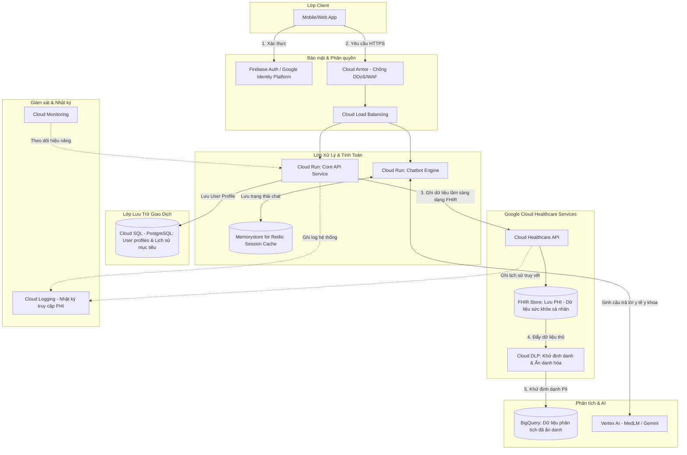

# Hạ Tầng Google Cloud Healthcare & Quy Trình Xử Lý Dữ Liệu Sức Khỏe

Tài liệu này mô tả chi tiết kiến trúc hạ tầng đám mây sử dụng các dịch vụ chuyên biệt cho Y tế của Google Cloud (Google Cloud Healthcare) và thiết lập các phương pháp, chỉ số KPI để xử lý, quản trị dữ liệu sức khỏe (béo phì & tiểu đường).

---

## 1. Sơ Đồ Cơ Sở Hạ Tầng Google Cloud Healthcare

Kiến trúc dưới đây được thiết kế nhằm đảm bảo khả năng mở rộng, tích hợp dữ liệu chuẩn y tế (FHIR) và tuân thủ các quy định bảo mật thông tin sức khỏe (HIPAA/HITRUST).

### Các thành phần chính trong hạ tầng:
1.  **Cloud Healthcare API (FHIR Store):** Thay vì lưu dữ liệu sức khỏe (chiều cao, cân nặng, vòng eo, điểm FINDRISC) vào DB thông thường, chúng được lưu trữ dưới dạng các **FHIR Resource** (Ví dụ: `Patient`, `Observation`). Đây là chuẩn trao đổi dữ liệu y tế toàn cầu, giúp app dễ dàng tích hợp với các hệ thống bệnh án lớn sau này.
2.  **Cloud Data Loss Prevention (DLP):** Đóng vai trò là chốt chặn bảo mật. Trước khi dữ liệu sức khỏe được chuyển từ cơ sở dữ liệu vận hành sang kho dữ liệu phân tích (**BigQuery**), DLP sẽ quét và loại bỏ hoặc mã hóa toàn bộ thông tin định danh cá nhân (PII) như Tên, Email, Số điện thoại, Ngày sinh cụ thể.
3.  **Vertex AI & MedLM:** Cung cấp mô hình ngôn ngữ lớn chuyên ngành y tế để xử lý truy vấn từ Chatbot một cách thông minh và có cơ sở khoa học.
4.  **Cloud Logging (Audit Logs):** Ghi lại lịch sử chi tiết mọi thao tác đọc/ghi dữ liệu sức khỏe (ai đã truy cập, truy cập khi nào). Đây là điều kiện bắt buộc để đạt chứng nhận tuân thủ y tế quốc tế.

---

## 2. Phương Pháp Xử Lý Dữ Liệu Sức Khỏe Chuẩn Y Khoa

Để đảm bảo dữ liệu thu thập từ chatbot được xử lý chính xác và an toàn, hệ thống áp dụng 3 phương pháp cốt lõi:

### 2.1. Chuẩn Hóa Dữ Liệu Theo Định Dạng FHIR (Fast Healthcare Interoperability Resources)
*   **Mã hóa chỉ số sinh trắc học (BMI, Vòng bụng):** Sử dụng hệ thống mã hóa **LOINC** (Logical Observation Identifiers Names and Codes) để gắn thẻ cho dữ liệu:
    *   *Mã LOINC cho BMI:* `39156-5` (Body mass index).
    *   *Mã LOINC cho Vòng bụng:* `8280-0` (Waist Circumference at clavicle).
    *   *Mã LOINC cho điểm số FINDRISC:* `88725-7` (Finnish Diabetes Risk Score).
*   **Mã hóa chẩn đoán (Béo phì, Nguy cơ tiểu đường):** Sử dụng hệ thống danh mục lâm sàng **SNOMED-CT**:
    *   *Mã SNOMED cho Béo phì:* `414916001` (Obesity).
    *   *Mã SNOMED cho Thừa cân:* `238131002` (Overweight).

### 2.2. Khử Định Danh & Ẩn Danh Hóa (De-identification)
*   **Phân tách dữ liệu:** Tách biệt hoàn toàn cơ sở dữ liệu định danh (`Cloud SQL` lưu Tên, Email) và cơ sở dữ liệu sức khỏe (`FHIR Store` lưu chỉ số lâm sàng). Hai bảng liên kết với nhau qua một mã định danh giả ngẫu nhiên (Pseudonymized ID).
*   **Chuyển đổi dữ liệu phân tích:** Khi đẩy dữ liệu qua BigQuery để làm nghiên cứu hoặc vẽ biểu đồ xu hướng cộng đồng:
    *   Ngày sinh cụ thể được chuyển đổi thành **Khoảng tuổi** (Ví dụ: 1990 -> nhóm 35-44).
    *   Địa chỉ cụ thể được rút gọn thành **Tỉnh/Thành phố**.
    *   Xóa bỏ hoàn toàn Tên và Email.

### 2.3. Kiểm Chuẩn Dữ Liệu Đầu Vào (Data Validation Pipeline)
*   Xây dựng bộ lọc logic ngay tại lớp API để phát hiện dữ liệu bất thường (Outliers) từ chatbot:
    *   Chiều cao: Phải nằm trong khoảng $50 \text{ cm} \le \text{Chiều cao} \le 250 \text{ cm}$.
    *   Cân nặng: Phải nằm trong khoảng $10 \text{ kg} \le \text{Cân nặng} \le 300 \text{ kg}$.
    *   Vòng bụng: Phải nằm trong khoảng $30 \text{ cm} \le \text{Vòng bụng} \le 200 \text{ cm}$.
*   Nếu người dùng nhập thông số vượt ngưỡng này, Chatbot sẽ lịch sự yêu cầu xác nhận lại thông tin trước khi tính toán.

---

## 3. Hệ Thống Chỉ Số Đo Lường Hiệu Suất (KPI) Chuẩn

Hệ thống quản trị và xử lý dữ liệu y tế được giám sát dựa trên 3 nhóm chỉ số KPI cốt lõi sau:

### Group A: Chất Lượng Dữ Liệu (Data Quality KPIs)

| Tên KPI | Công thức / Định nghĩa | Mục tiêu (Target) | Ý nghĩa |
| :--- | :--- | :---: | :--- |
| **Độ hoàn thiện dữ liệu** *(Data Completeness)* | $\frac{\text{Số lượt khám có đủ 8 yếu tố FINDRISC}}{\text{Tổng số lượt bấm 'Hoàn thành'}}$ | **$\ge$ 98%** | Đảm bảo không bị khuyết dữ liệu quan trọng khi đưa vào phân tích. |
| **Độ chính xác tính toán** *(Calculation Accuracy)* | $\frac{\text{Số bản ghi có BMI tính toán khớp logic}}{\text{Tổng số bản ghi}}$ | **100%** | Tuyệt đối không được sai sót logic tính toán BMI và điểm FINDRISC. |
| **Tỷ lệ dữ liệu dị biệt được lọc** *(Outlier Detection Rate)* | $\frac{\text{Số ca nhập liệu bất thường được phát hiện}}{\text{Tổng số ca nhập liệu thực tế bất thường}}$ | **100%** | Đảm bảo bộ lọc kiểm chuẩn hoạt động hoàn hảo, không cho dữ liệu "rác" vào hệ thống. |

### Group B: Hiệu Năng & Độ Trễ (Performance & Latency KPIs)

| Tên KPI | Công thức / Định nghĩa | Mục tiêu (Target) | Ý nghĩa |
| :--- | :--- | :---: | :--- |
| **Thời gian phản hồi tính toán** *(Calculation Latency)* | Thời gian từ lúc nhận đủ dữ liệu đến khi trả về kết quả BMI & FINDRISC. | **< 200ms** | Đảm bảo trải nghiệm tức thì cho người dùng. |
| **Độ trễ phản hồi của Chatbot** *(Chatbot Response Latency)* | Thời gian từ lúc người dùng gửi tin nhắn đến khi nhận phản hồi từ mô hình AI. | **< 2.0s** *(Stream chữ: < 200ms)* | Giữ tương tác mượt mà, không bị cảm giác "chờ đợi lâu". |
| **Độ trễ đồng bộ dữ liệu** *(Data Sync Latency)* | Thời gian đồng bộ từ FHIR Store qua Cloud DLP sang BigQuery. | **< 5 phút** | Dữ liệu báo cáo thống kê luôn được cập nhật gần với thời gian thực (Near Real-time). |

### Group C: Bảo Mật & Tuân Thủ (Security & Compliance KPIs)

| Tên KPI | Công thức / Định nghĩa | Mục tiêu (Target) | Ý nghĩa |
| :--- | :--- | :---: | :--- |
| **Tỷ lệ ghi nhật ký kiểm toán** *(Audit Logging Rate)* | $\frac{\text{Số thao tác đọc/ghi PHI được ghi log}}{\text{Tổng số thao tác đọc/ghi PHI thực tế}}$ | **100%** | Đảm bảo mọi lượt truy cập dữ liệu bệnh nhân đều có thể truy vết (để phục vụ thanh tra y tế). |
| **Tỷ lệ mã hóa dữ liệu** *(Encryption Coverage)* | Tỷ lệ dữ liệu sức khỏe được mã hóa cả khi lưu trữ (at rest) và truyền tải (in transit). | **100%** | Chống rò rỉ dữ liệu ngay cả khi hạ tầng vật lý bị tấn công. |
| **Mức độ rò rỉ PII trong BigQuery** *(PII Leakage Rate)* | Số trường thông tin định danh (Tên, Email) bị lọt vào BigQuery phân tích. | **0 trường** | Đảm bảo an toàn tuyệt đối cho người dùng khi thực hiện các phân tích xu hướng hoặc nghiên cứu. |
